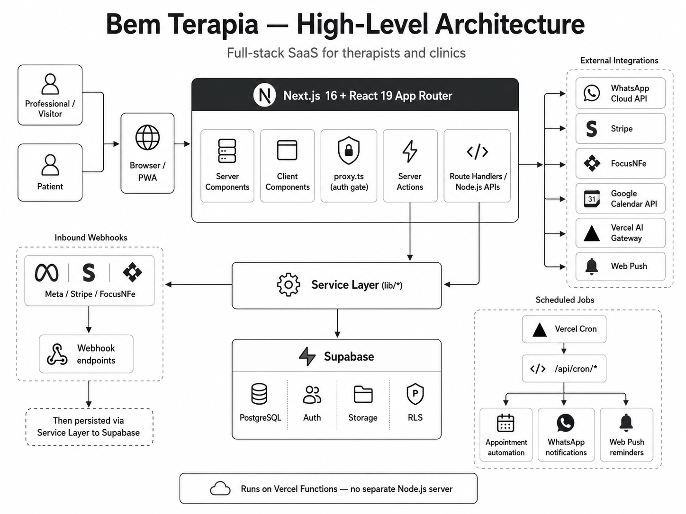
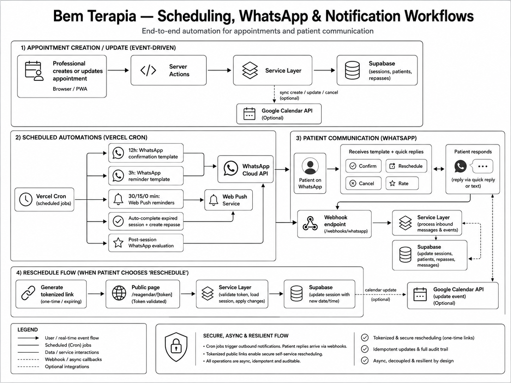
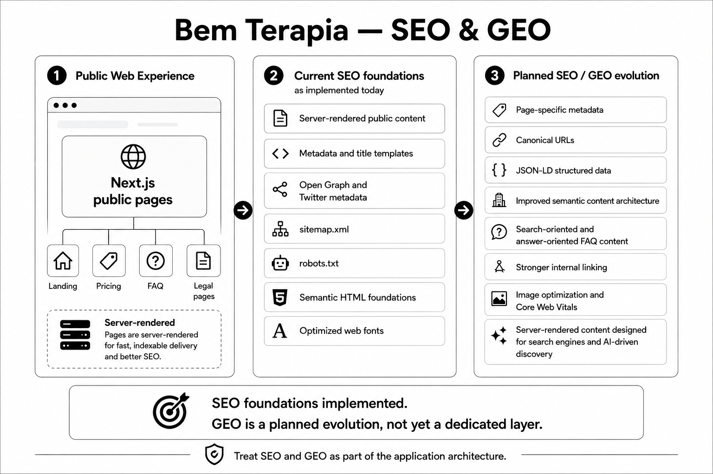

# Bem Terapia — Architecture Case Study

**Website:** https://www.bemterapia.com.br/

Bem Terapia is my most recent project: a SaaS platform for therapists and clinics covering appointment scheduling, patient management, clinical reports, financial workflows, subscriptions and automated patient communication.

## Tech Stack

* React 19
* Next.js 16
* TypeScript
* Node.js runtime
* Tailwind CSS
* Supabase / PostgreSQL
* Vercel
* WhatsApp Cloud API
* Stripe
* Google Calendar API
* Vercel AI Gateway

The application uses the **Next.js App Router** with a combination of Server Components and Client Components. Backend responsibilities are implemented through **Server Actions, Route Handlers and server-only service modules**, running as Vercel Functions rather than a separate Node.js server.

## Architecture Overview

The application follows a full-stack Next.js architecture with clear boundaries between UI, server-side application logic, persistence and external integrations.

## Frontend Architecture

The frontend is organized by domain, with reusable UI components separated from business-specific components.

Examples include:

* Agenda and calendar
* Patients
* Clinical reports
* Finance
* Billing
* Notifications
* PWA
* Authentication

Desktop and mobile experiences use responsive layouts, including a dedicated mobile agenda experience.

## Node.js / Backend

Node.js responsibilities include:

* Authentication and session handling
* Appointment and patient business logic
* REST endpoints
* Server Actions
* Webhooks
* Scheduled jobs
* External API integrations
* Security and validation
* Idempotent asynchronous processing

REST Route Handlers are used for integrations such as WhatsApp, Stripe, Google Calendar, Web Push and AI, while authenticated application CRUD primarily uses Server Actions.

## Asynchronous Workflows

A significant part of the architecture is event-driven or scheduled.

Vercel Cron executes five scheduled workflows, while external systems communicate back through secured webhook endpoints.

Key workflows include:

* Appointment confirmation via WhatsApp
* Appointment reminders
* Web Push reminders
* Automatic session completion
* Financial repasse creation
* Post-session evaluation
* Stripe subscription webhooks
* WhatsApp inbound webhooks
* Tokenized patient rescheduling

## PWA

Bem Terapia can operate as an installable PWA.

The implementation includes:

* Web App Manifest
* Service Worker
* Installable standalone experience
* iOS PWA support
* Web Push notifications
* Application update detection
* PWA splash screen

The Service Worker is focused on push and lifecycle management; offline asset caching is intentionally not part of the current implementation.

## Data Layer

The persistence layer uses **Supabase PostgreSQL** without an ORM.

Data access is separated between:

* User-scoped access protected by Row Level Security
* Administrative access restricted to trusted backend workflows such as crons and webhooks

Main domains include patients, sessions, reports, subscriptions, financial records, notifications and integration state.

## Security

Relevant architectural protections include:

* Supabase Row Level Security
* Meta webhook HMAC SHA-256 validation
* Stripe webhook signature validation and idempotency
* Protected Cron endpoints
* AES-256-GCM encryption for Google OAuth tokens
* Signed OAuth state
* Open redirect protection
* Server-only access to privileged credentials

## SEO & GEO

The public website already includes the technical foundations for search visibility:

* Server-side rendered public content
* Metadata and title templates
* Open Graph and Twitter metadata
* Sitemap
* Robots configuration
* Semantic HTML foundations
* Optimized web fonts

The next evolution of the public platform focuses on both traditional SEO and **Generative Engine Optimization (GEO)**.

Planned improvements include:

* Page-specific metadata and canonical URLs
* Structured data using JSON-LD
* Improved semantic content architecture
* Search-oriented and answer-oriented FAQ content
* Stronger internal linking
* Image and Core Web Vitals optimization
* Server-rendered content designed for both search engines and AI-driven discovery

This approach treats SEO and GEO as part of the application architecture rather than isolated marketing concerns.

## Engineering Highlights

* React 19 + Next.js 16 full-stack architecture
* Strong frontend/backend boundaries
* Node.js backend and integration layer
* REST APIs and secure webhooks
* PWA and Web Push
* Asynchronous appointment workflows
* WhatsApp Cloud API integration
* PostgreSQL with RLS
* Google Calendar synchronization
* Stripe subscription lifecycle
* AI-assisted report generation
* Vercel serverless infrastructure
* SEO foundations with a planned GEO evolution

---

This case study is a simplified architectural representation of the project.

No credentials, customer data, proprietary source code or confidential business information are included.
