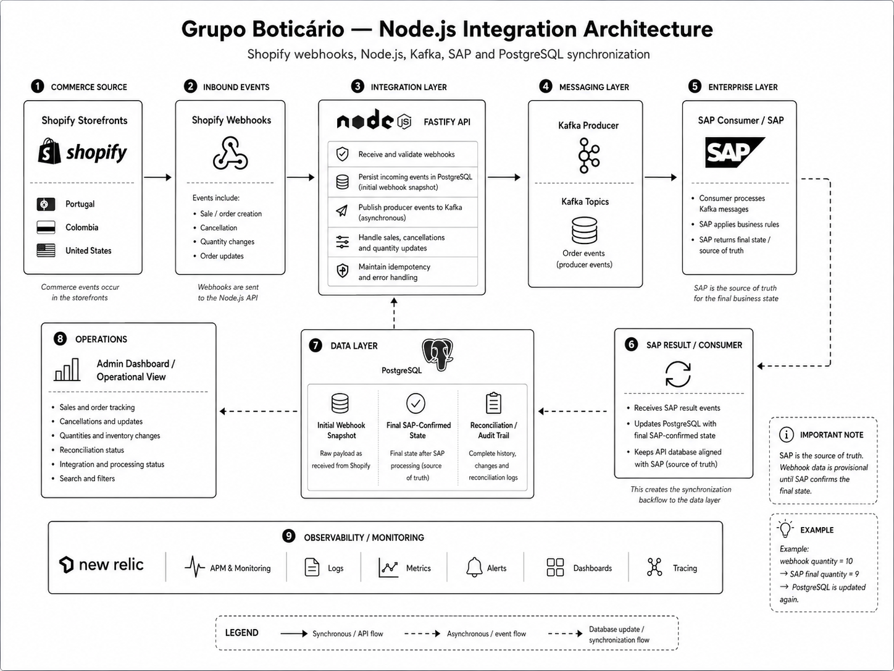

# Grupo Boticário — Node.js Integration Architecture

Architecture case focused on a production integration pipeline connecting **Shopify storefronts, a Node.js API, Kafka, PostgreSQL and SAP** for Grupo Boticário's international e-commerce operation.

The platform supported storefronts across **Portugal, Colombia and the United States**.

## Tech Stack

* Node.js
* Fastify
* TypeScript
* Shopify
* Shopify Webhooks
* Kafka
* PostgreSQL
* SAP
* New Relic
* React
* Hydrogen
* Remix

## Project Context

Grupo Boticário operated international Shopify storefronts across multiple markets.

One of the main integration challenges was connecting the Shopify commerce layer with SAP while maintaining reliable event processing, traceability, reconciliation and synchronized data.

I was responsible for implementing the **end-to-end order integration pipeline for the Colombia operation**.

## Architecture Overview

The integration followed an event-driven architecture.

Shopify generated commerce events through webhooks. The Node.js API received and persisted the initial state, published events to Kafka, and SAP consumed and processed those events.

After processing, SAP published the final business result back through Kafka. The Node.js API consumed that result and updated PostgreSQL with the **SAP-confirmed state**.

[](./node-architecture.png)

The complete flow was:

```text
Shopify Storefront
      |
      v
Shopify Webhooks
      |
      v
Node.js / Fastify API
      |
      +---- Validate and normalize payload
      +---- Persist initial state in PostgreSQL
      +---- Publish event to Kafka
                          |
                          v
                    Kafka Topic
                          |
                          v
                    SAP Consumer
                          |
                          v
                         SAP
                          |
                          +---- Apply business rules
                          +---- Process sale / cancellation / quantity / status
                          +---- Determine final business state
                          |
                          v
                    Kafka Topic
                          |
                          v
                Node.js API Consumer
                          |
                          v
                     PostgreSQL
                          |
                          v
              SAP-confirmed final state
```

Shopify initiated the event, but **SAP remained the final source of truth**.

## Node.js Backend

The backend integration service was built with **Node.js and Fastify**.

Its responsibilities included:

* Receiving Shopify webhook events
* Validating and normalizing incoming payloads
* Processing order lifecycle events
* Persisting initial Shopify event data
* Publishing producer events to Kafka
* Consuming SAP result events from Kafka
* Updating PostgreSQL with SAP-confirmed values
* Maintaining idempotent processing
* Supporting reconciliation workflows
* Handling failures and retries
* Providing operational visibility
* Supporting production monitoring

The Node.js service acted as the integration boundary between the commerce platform and SAP.

## Event-Driven Integration

Kafka was used as the messaging layer between the Node.js API and SAP.

The architecture supported communication in both directions.

### Outbound Flow

```text
Shopify
   |
   v
Webhook
   |
   v
Node.js / Fastify API
   |
   v
Kafka Producer
   |
   v
Kafka
   |
   v
SAP Consumer
   |
   v
SAP
```

The outbound flow:

* Shopify generates a commerce event
* Shopify sends a webhook to the Node.js API
* The API validates and processes the payload
* The initial state is persisted in PostgreSQL
* The API publishes an event to Kafka
* SAP consumes the Kafka event
* SAP processes the event according to enterprise business rules

### Return Flow

```text
SAP
   |
   v
Kafka Producer
   |
   v
Kafka
   |
   v
Node.js Consumer
   |
   v
PostgreSQL
```

The return flow:

* SAP determines the final business state
* SAP publishes the result back through Kafka
* The Node.js integration consumes the event
* PostgreSQL is updated with the final SAP-confirmed values

This created an asynchronous and decoupled integration between Shopify and SAP.

## Source of Truth and Database Synchronization

The API persisted the initial Shopify state immediately after receiving a webhook.

That value was not automatically considered final.

For example:

```text
Shopify webhook
quantity = 10
```

The API stores:

```text
PostgreSQL
quantity = 10
status = awaiting SAP processing
```

The event is then processed by SAP.

SAP may determine:

```text
SAP confirmed quantity = 9
```

The return event flows through Kafka:

```text
SAP
  |
  v
Kafka
  |
  v
Node.js Consumer
  |
  v
PostgreSQL
```

The database is then synchronized:

```text
PostgreSQL
quantity = 9
status = SAP confirmed
```

This ensured that the API database remained aligned with **SAP as the source of truth**.

## Business Events

The integration handled multiple commerce lifecycle events, including:

* Sales
* Order creation
* Cancellations
* Quantity changes
* Inventory updates
* Order updates
* Fulfilment changes
* Status changes

The same architectural principle applied to each flow:

```text
Shopify event
      |
      v
Initial API state
      |
      v
Kafka
      |
      v
SAP processing
      |
      v
Kafka result
      |
      v
Final API state
```

## Persistence and Reconciliation

Each order was mirrored into **PostgreSQL**.

The persistence layer supported:

* Initial webhook intake
* Current integration state
* SAP-confirmed final state
* Shopify-to-SAP reconciliation
* Audit history
* Processing status
* Operational troubleshooting

The database provided the integration layer with its own operational view while remaining synchronized with SAP.

## Admin Dashboard

An internal administration interface provided visibility into the integration lifecycle.

It supported monitoring of:

* Order intake
* Sales
* Fulfilment
* Cancellations
* Quantity changes
* Inventory changes
* Integration status
* SAP processing status
* Reconciliation state
* Processing errors

This allowed technical and operational teams to track the complete lifecycle of an order across Shopify, the integration API and SAP.

## Observability

The Node.js integration service was instrumented with **New Relic**.

Production observability included:

* API monitoring
* Logs
* Metrics
* Alerts
* Integration health
* Error investigation
* Operational troubleshooting

This was important because the integration crossed multiple independently operating systems:

```text
Shopify
→ Node.js
→ Kafka
→ SAP
→ Kafka
→ Node.js
→ PostgreSQL
```

## Frontend and Commerce Context

The Node.js integration work was part of a broader international e-commerce architecture.

During the same engagement, I also worked on:

* International Shopify storefronts
* React-based commerce experiences
* Shopify Liquid
* Hydrogen
* Remix
* Design system architecture
* Migration from Liquid to Hydrogen
* Performance improvements
* Multi-market storefront architecture

The **Essence design system** was designed to support both existing Shopify 2.0 storefronts and the gradual migration toward Hydrogen.

This allowed the migration from Liquid to Hydrogen to happen incrementally instead of requiring a complete rewrite for each market.

## Engineering Highlights

* Production Node.js backend using Fastify
* End-to-end integration architecture
* Shopify webhook processing
* Kafka producer and consumer flows
* Event-driven communication
* SAP enterprise integration
* PostgreSQL persistence
* Source-of-truth synchronization
* Data reconciliation
* Idempotent processing
* Decoupled commerce and enterprise systems
* Production observability with New Relic
* Internal operational dashboard
* International e-commerce environment
* End-to-end technical ownership

## Architectural Decisions

### Node.js as the Integration Layer

Node.js and Fastify provided the service boundary between Shopify and the enterprise integration ecosystem.

The API was responsible for receiving commerce events, managing integration state and coordinating asynchronous communication.

### Kafka for Decoupled Communication

Kafka separated Shopify-facing processing from SAP processing.

Neither Shopify nor the Node.js API needed to wait synchronously for SAP to finish the complete business workflow.

### Bidirectional Event Flow

Kafka was used not only to send events toward SAP but also to receive SAP-confirmed results.

```text
Node.js
→ Kafka
→ SAP

SAP
→ Kafka
→ Node.js
```

This allowed both systems to evolve independently while maintaining synchronized state.

### Initial Persistence Before SAP Processing

The initial Shopify webhook state was persisted immediately.

This provided visibility into what Shopify originally sent and prevented the integration from depending entirely on the availability or processing time of downstream systems.

### SAP as the Source of Truth

The Shopify webhook represented the initial commerce event.

SAP determined the final enterprise business state.

The PostgreSQL database was therefore updated again after SAP processing to ensure that the integration API always reflected the authoritative result.

### Reconciliation as Part of the Architecture

PostgreSQL was not only persistence for incoming events.

It also provided the data necessary to compare:

```text
Shopify state
vs.
SAP-confirmed state
```

This supported reconciliation, traceability and operational troubleshooting.

### Separation from the Storefront

The Shopify storefront remained independent from enterprise integration concerns.

Commerce UI:

```text
React / Shopify / Hydrogen
```

Integration:

```text
Node.js / Fastify / Kafka / PostgreSQL / SAP
```

This separation allowed frontend and backend integration architectures to evolve independently.

---
